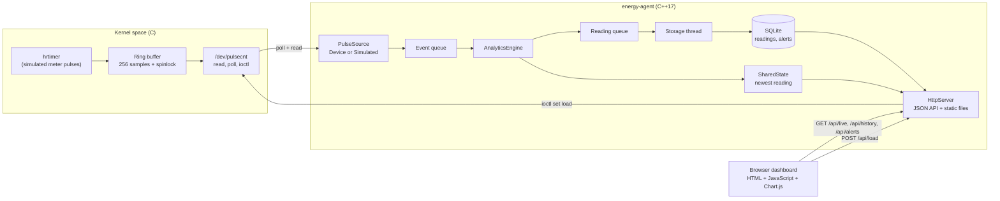
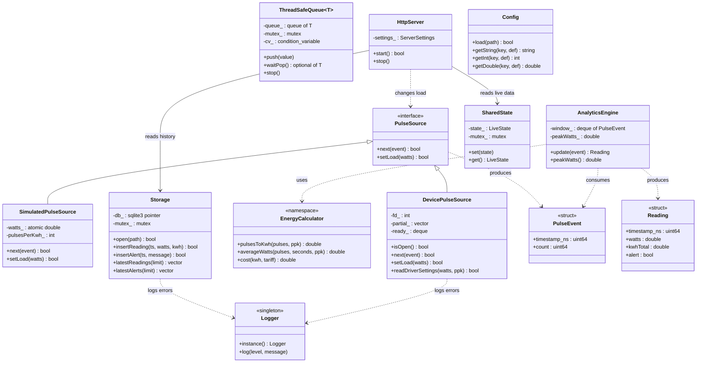
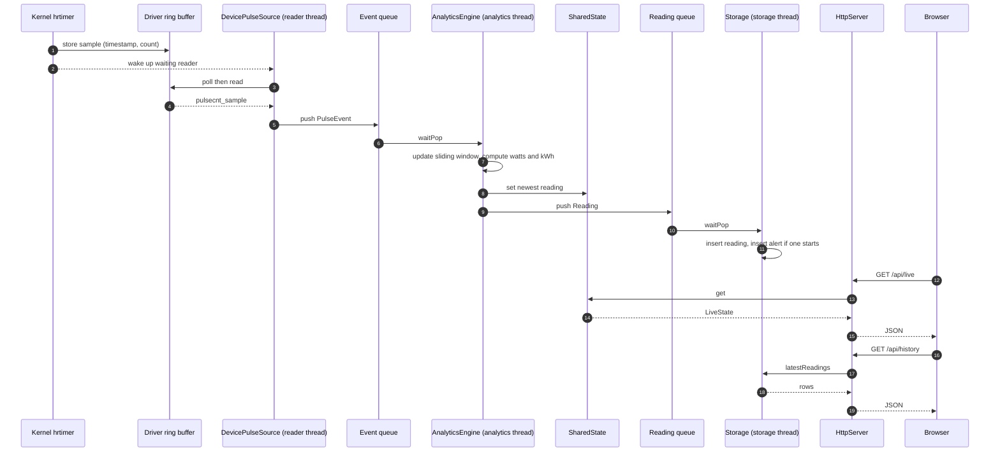
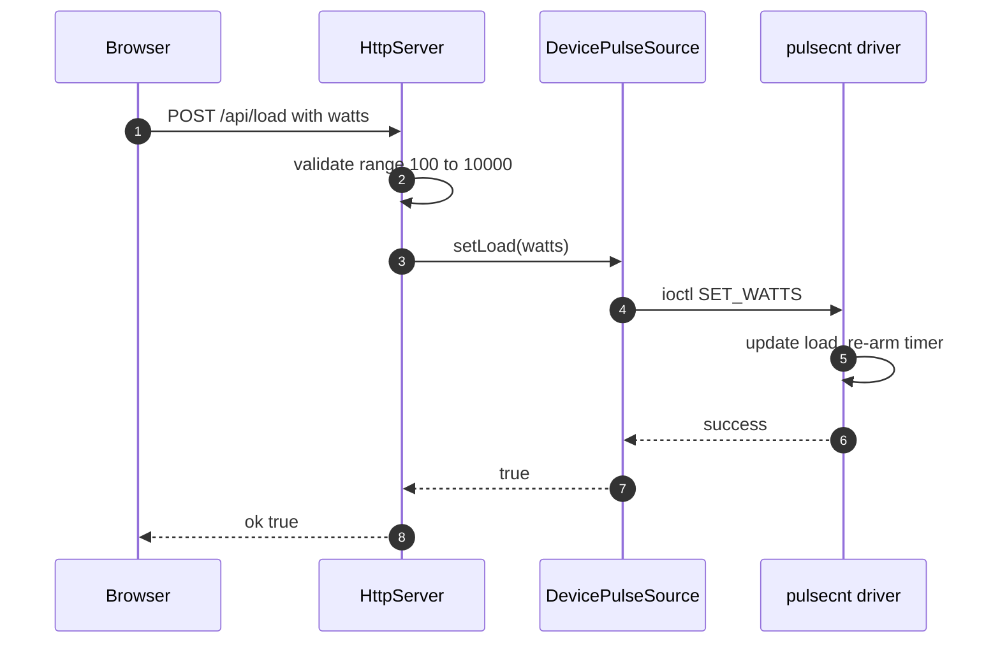
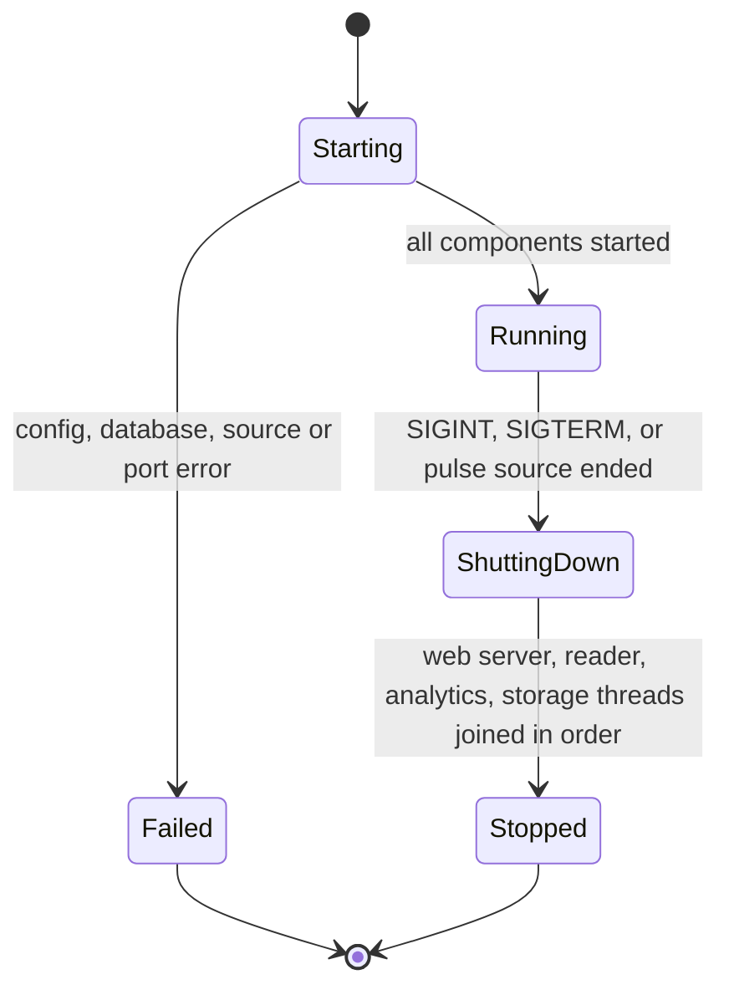
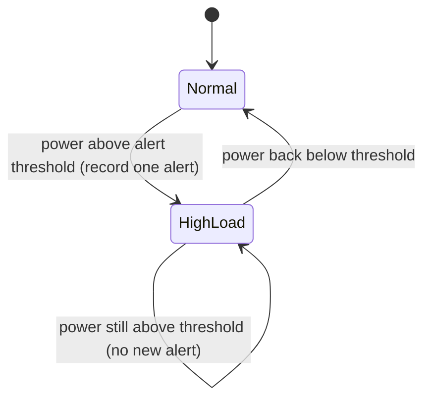
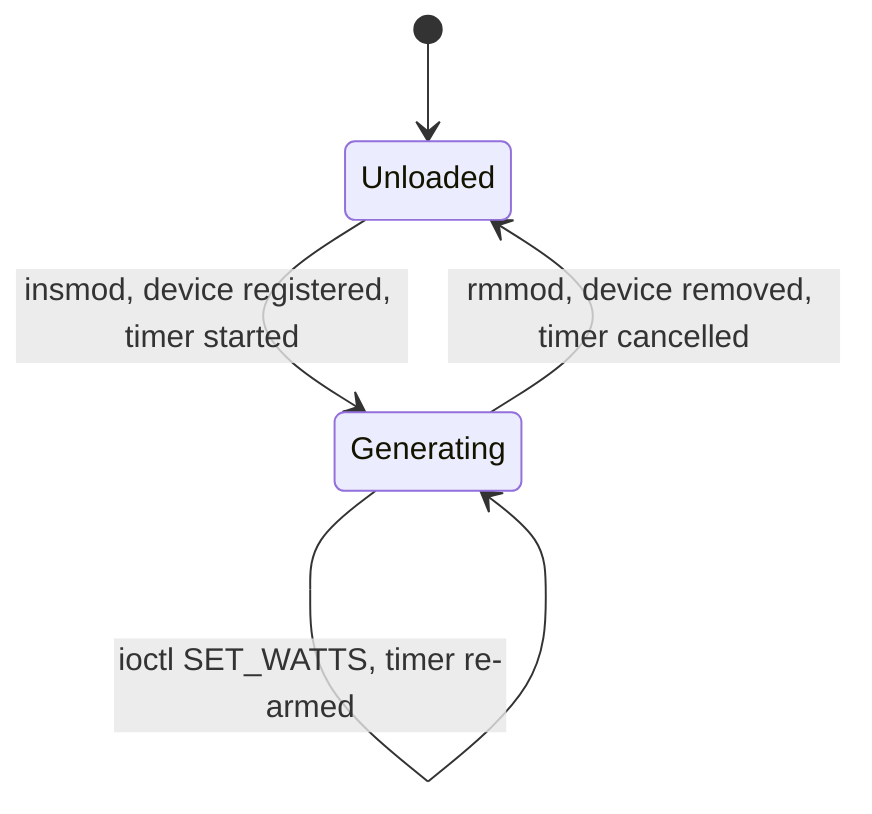

# System Design: Smart Energy Smart-Meter Pulse Counter & Analytics Agent

This document describes the architecture and design of the project. The diagrams are written in Mermaid, so GitHub draws them when you open this file in the repository.

## 1. Architecture

A Linux kernel module simulates a meter's pulse output. A C++ daemon reads the pulses, computes power and energy, stores the results in SQLite, and serves a web dashboard.

### Components and responsibilities

| Component | Language | Responsibility |
|---|---|---|
| `pulsecnt` kernel module | C | Generates timestamped pulses with an hrtimer, buffers them, and exposes them through `/dev/pulsecnt` (`read`, `poll`, `ioctl`) |
| `PulseSource` (`DevicePulseSource`, `SimulatedPulseSource`) | C++ | Delivers `PulseEvent` records. The device version reads the driver, the simulated version needs no kernel module |
| `ThreadSafeQueue<T>` | C++ | Passes data between threads without data races, and supports a clean stop |
| `AnalyticsEngine` | C++ | Keeps a sliding time window and computes power (W), energy (kWh), peak power, and the alert flag |
| `EnergyCalculator` | C++ | Pure conversion functions: pulses to kWh, pulses over time to watts, kWh to cost |
| `Storage` | C++ | Saves readings and alerts in SQLite, and reads the latest rows back |
| `SharedState` | C++ | Holds the newest reading for the live API, protected by a mutex |
| `HttpServer` | C++ | Serves the dashboard files and the JSON API on its own thread |
| `Config`, `Logger` | C++ | Read `agent.conf`, and write timestamped log lines from any thread |
| Dashboard | HTML/JS | Shows live power, energy, cost, peak, status, a history chart, and alerts, and lets the user change the load |

### Threads in the agent

| Thread | Work |
|---|---|
| Reader | Waits for pulses with `poll()`, reads them, pushes them into the event queue |
| Analytics | Takes events from the queue, computes a reading, publishes it to `SharedState`, pushes it to the reading queue |
| Storage | Takes readings from the queue, writes them to SQLite, and records an alert when one starts |
| HTTP | Answers browser requests |
| Main | Waits for Ctrl+C or SIGTERM, then stops everything in pipeline order |

## 2. Data structures

| Structure | Fields | Used for |
|---|---|---|
| `pulsecnt_sample` (kernel and agent) | `timestamp_ns`, `count` (both 64-bit) | One pulse as returned by `read()` |
| `pulsecnt_stats` | `count`, `dropped`, `watts`, `pulses_per_kwh` | Result of the `GET_STATS` ioctl |
| `PulseEvent` | `timestamp_ns`, `count` | One pulse inside the agent |
| `Reading` | `timestamp_ns`, `watts`, `kwhTotal`, `alert` | Output of the analytics engine |
| `LiveState` | `hasData`, `timestamp_ns`, `watts`, `kwhTotal`, `peakWatts`, `alert` | Newest reading for `/api/live` |
| Driver ring buffer | 256 `pulsecnt_sample` slots, free-running head and tail indices | Holds pulses until userspace reads them. When it is full, the oldest sample is dropped and counted |
| SQLite table `readings` | `id`, `ts_ns`, `watts`, `kwh_total` | History for the chart |
| SQLite table `alerts` | `id`, `ts_ns`, `message` | Alert list |

### Driver interface

| Operation | Behaviour |
|---|---|
| `read()` | Returns one or more 16-byte samples. Blocks until a pulse exists, unless the file is opened non-blocking |
| `poll()` | Reports the device readable when at least one pulse is waiting |
| `ioctl RESET` | Clears the counter and the buffer |
| `ioctl SET_WATTS` | Changes the simulated load (1 to 100000 W) and re-arms the timer |
| `ioctl GET_STATS` | Returns count, dropped samples, load, and the meter constant |
| Module parameters | `watts` (default 1500) and `pulses_per_kwh` (default 3600) |

The interval between pulses is `3.6e15 / (watts x pulses_per_kwh)` nanoseconds. For example, 1000 W at 3600 pulses per kWh gives one pulse per second.

## 3. Class diagram (C++ agent)

## 4. Sequence diagram (one pulse, end to end)

### Changing the load from the dashboard

## 5. State machine diagrams

### Agent lifecycle

### Load status (alerts)

### Driver lifecycle

## 6. Shutdown order

The agent stops its components from the front of the pipeline to the back, so nothing is lost and no thread waits forever:

1. The web server stops, so no new requests arrive.
2. The reader thread stops, because its `next()` call sees the shutdown flag.
3. The event queue is stopped and the analytics thread drains it and ends.
4. The reading queue is stopped and the storage thread drains it and ends.

## 7. Design decisions

- **One interface for pulse sources.** The agent does not care whether pulses come from the driver or the simulator. This allowed the whole pipeline to be built and tested before the driver existed.
- **Queues between threads.** Each thread has one job, and a slow database write never delays pulse reading.
- **Pure functions for the maths.** `EnergyCalculator` has no state and no I/O, so it is easy to unit test.
- **Shared state for live data, SQLite for history.** Live values are served from memory without touching the disk. History survives restarts.
- **Driver ring buffer with drop-oldest.** A slow reader can never block the timer in interrupt context. Lost samples are counted in `dropped`.
- **The driver is authoritative for the meter constant.** In device mode the agent reads `pulses_per_kwh` from the driver, so a config mismatch cannot produce wrong energy values.

## 8. Known limitations

- The meter is simulated. The driver's timer replaces a real GPIO interrupt.
- The device node is world-accessible (mode 0666), which is acceptable for a demonstration but not for production.
- Power needs at least two pulses inside the averaging window, so the first reading after a start is 0 W.
- The dashboard chart uses text labels, so gaps in time are not drawn to scale.
